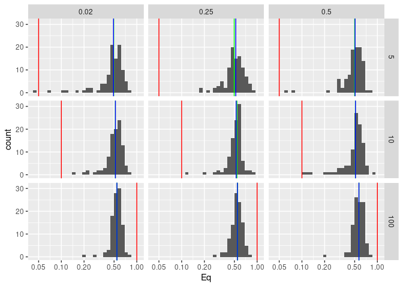
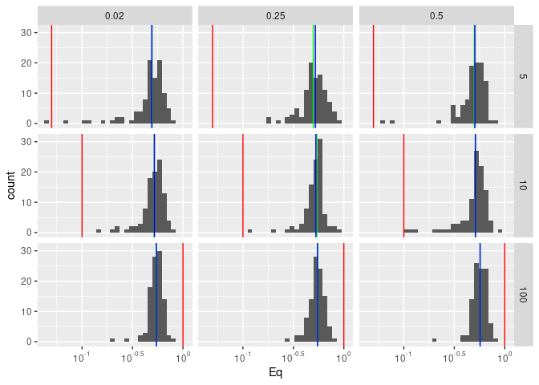
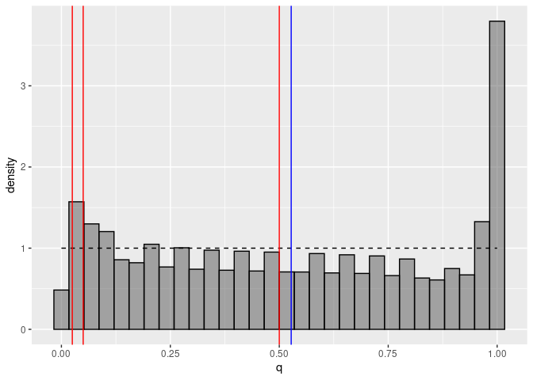

Assignment 2
================
Daniel Bonnery, Max Kramkimel, Augustin Poissonnier
Dec 5, 2023

# Bayesian Statistics, Assignment 2

## Results

### Plot 1

<!-- --><!-- -->

We plot the histograms of the empirical means of q by values of s and
R2y. The red line represents s/k. The blue line represents the mean of
the empirical means. We use a log10 scale for the x axis.

### Plot 2

<!-- -->

We plot the histograms of the empirical means of q by values of s and
R2y. The red line represents s/k. The blue line represents the mean of
the empirical means. We use a log10 scale for the x axis.

## How to run

### Install the following packages:

dplyr, ggplot2, glmnet, invgamma, MASS, plyr, renv, stats, stringr,
tools

### Copy and execute the project:

-   Clone the project to a local repository via:

``` r
system("git clone https://github.com/Augustin202/Stat_bayes.git")
```

-   open the .rproj file in rstudio
-   run:

``` r
source(main.R)
```
