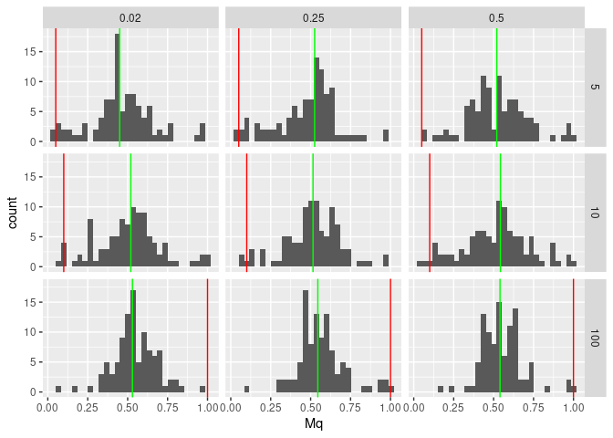

Assignment 2
================
Daniel Bonnery, Max Kramkimel, Augustin Poissonnier
Dec 5, 2023

# Bayesian Statistics, Assignment 2

## All plots

### Question 2.a

<!-- -->

We plot the histograms of the empirical means of q by values of s and
R2y. The red line represents s/k. The blue line represents the mean of
the empirical means. We use a log10 scale for the x axis.

### Question 2.b^

<!-- -->

### Question 2.c

<!-- --><!-- --><!-- -->
