Assignment 2
================
Daniel Bonnery, Max Kramkimel, Augustin Poissonnier
Dec 5, 2023

# Bayesian Statistics, Assignment 2

## Comparaison of Augustin and Daniel samplers

### I Test sampler r2 q

``` r
a=default_a
b=default_b
A=aa=default_aa
B=bb=default_bb
k=default_k
s=50
r_y=default_r_y[3]
X=xx=generate_multiple_x(number_of_datasets = 1)[[1]]
Y=y=generate_single_y(s=s,r_y=r_y,xx = xx)
sigma2=12;
sigma_epsilon=sqrt(sigma2)
phi=0
z=rep(1:0,each=50)
beta<-(`[<-`)(z,1:50,rnorm(50))
m=1000
aug=draw_conditional_posterior_R2_q(m,Y,U,X,sigma2,phi,beta,z,a,b,A,B)
U=u=generate_u();
barvx=barvx_f(xx)
tbetabeta=t(beta)%*%beta
s_z=sum(z)
r2_q_grid=r2_q_grid_generate()
dan=sample_r2_q_cond_y_u_x_theta_z(sigma_epsilon,barvx,k,a,b,aa,bb,tbetabeta,s_z,r2_q_grid,m=m)
plot(sort(dan[,1]),sort(aug[,1]));abline(0,1,col='red')
```

<!-- -->

``` r
plot(sort(dan[,2]),sort(aug[,2]));abline(0,1,col='red')
```

<!-- -->

``` r
cbind("Daniel"=
system.time(plyr::r_ply(100,sample_r2_q_cond_y_u_x_theta_z(sigma_epsilon,barvx,k,a,b,aa,bb,tbetabeta,s_z,r2_q_grid,m=1))),
Augustin=
system.time(plyr::r_ply(100,draw_conditional_posterior_R2_q(m,Y,U,X,sigma2,phi,beta,z,a,b,A,B))))
```

    FALSE            Daniel Augustin
    FALSE user.self   1.236   19.456
    FALSE sys.self    0.048    0.000
    FALSE elapsed     1.297   19.459
    FALSE user.child  0.000    0.000
    FALSE sys.child   0.000    0.000

``` r
#dist_conditional_posterior_R2_q(Y,U,X,sigma2,phi,beta,z,a,b,A,B)|>
#  dplyr::rename(Augustin=prob)|>
#  dplyr::full_join(dist_r2_q_cond_y_u_x_theta_z(sigma_epsilon,barvx,k,a,b,aa,bb,tbetabeta,s_z,r2_q_grid))|>
#  dplyr::rename(Daniel=prob)|>ggplot(aes(x=Daniel,y=Augustin))+geom_points()

q<-runif(m)
R2<-r2<-runif(m)

cbind(q=q,r2=r2,Daniel=loglikelihood_r2_q_cond_y_u_x_theta_z_a_b_aa_bb(r2,q,sigma_epsilon,barvx,k,a,b,aa,bb,tbetabeta,s_z),
        Augustin=likelihood_conditional_posterior_R2_q(R2,q,Y,U,X,sigma2,phi,beta,z,a,b,A,B,correction=FALSE)|>log())|>as.data.frame()->
  alllogprobs

  alllogprobs|>
  ggplot(aes(x=Daniel,y=Augustin))+geom_point()
```

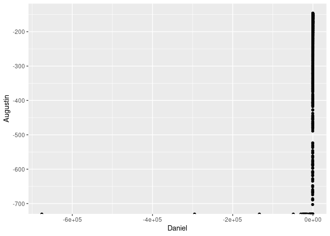<!-- -->

``` r
  alllogprobs|>
  ggplot(aes(x=q,y=r2,alpha=abs((Daniel-Augustin)/(Daniel+Augustin)),
             colour=factor(sign((Daniel-Augustin)/(Daniel+Augustin)))))+geom_point()
```

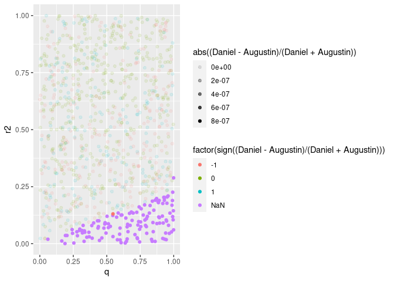<!-- -->

``` r
  alllogprobs|>
  ggplot(aes(x=q,y=r2),fill=factor(Daniel==-Inf))+geom_point()
```

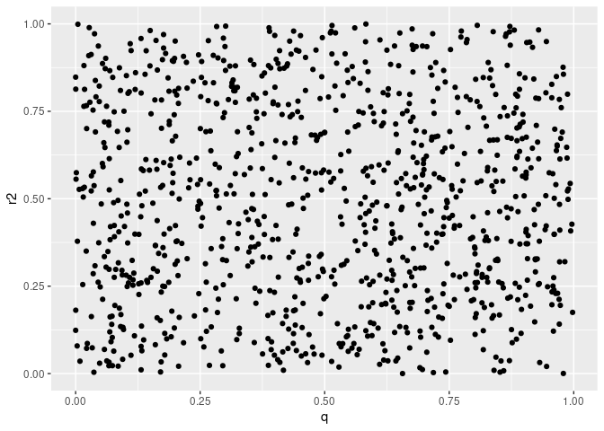<!-- -->

``` r
  alllogprobs|>
    dplyr::filter(Augustin==-Inf)|>
  ggplot(aes(x=q,y=r2))+geom_point()
```

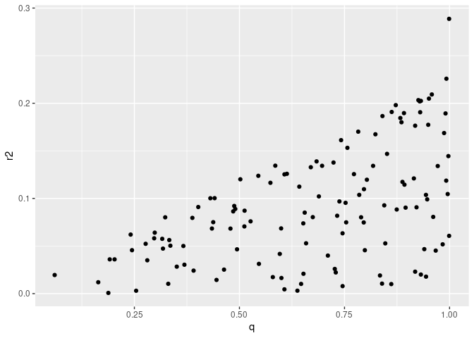<!-- -->

``` r
  alllogprobs|>
    dplyr::filter(Augustin>-Inf)|>
  ggplot(aes(x=q,y=r2))+geom_point()
```

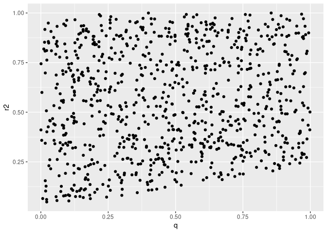<!-- -->

``` r
  summary(alllogprobs$Daniel[alllogprobs$Augustin==-Inf])
```

    FALSE    Min. 1st Qu.  Median    Mean 3rd Qu.    Max. 
    FALSE  -46012   -2147   -1221   -3100    -827    -660

``` r
  summary(alllogprobs$Daniel[alllogprobs$Augustin!=-Inf])
```

    FALSE    Min. 1st Qu.  Median    Mean 3rd Qu.    Max. 
    FALSE  -722.1  -278.9  -204.1  -246.5  -167.7  -143.7

``` r
    alllogprobs|>
      dplyr::filter(Augustin>=-200)|>
  ggplot(aes(x=q,y=r2,alpha=abs((Daniel-Augustin)/(Daniel+Augustin)),
             colour=factor(sign((Daniel-Augustin)/(Daniel+Augustin)))))+geom_point()
```

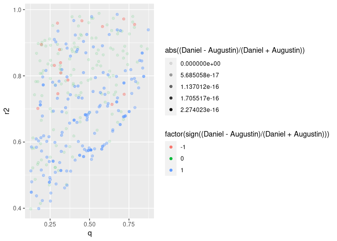<!-- -->

### II Test sampler z\_i

``` r
a=default_a
b=default_b
A=aa=default_aa
B=bb=default_bb
k=default_k
s=50
r_y=default_r_y[3]
X=xx=generate_multiple_x(number_of_datasets = 1)[[1]]
Y=y=generate_single_y(s=s,r_y=r_y,xx = xx)
sigma2=12;
sigma_epsilon=sqrt(sigma2)
phi=0
z=rep(1:0,each=50)
beta<-(`[<-`)(z,1:50,rnorm(50))
m=1000
R2=r2=.8
v_X=sum_var(X)
U=u=generate_u();
barvx=barvx_f(xx)
tbetabeta=t(beta)%*%beta
s_z=sum(z)
r2_q_grid=r2_q_grid_generate()
q=mean(z)
gamma2=gamma2_f(r2 = r2,k = k,q = q,barvx = barvx)
gamma2_aug=R2/(k*q*v_X*(1-R2))
tilde_y=y
ttildeytildey=t(tilde_y)%*%tilde_y
tt=default_tt
aug=sample_conditional_posterior_zi(Y,U,X,sigma2,phi,gamma2_aug,q,z,i=1,m=m)
dan=sample_zi_cond_zj_y_u_x_phi_gamma(z,i=1,tilde_y,ttildeytildey,xx,q,tt,k,gamma2,m=m)
mean(aug);mean(dan)
```

    FALSE [1] 0.464

    FALSE [1] 0.471

``` r
cbind("Daniel"=
system.time(plyr::r_ply(100,sample_zi_cond_zj_y_u_x_phi_gamma(z,i=1,tilde_y,ttildeytildey,xx,q,tt,k,gamma2,m=1))),
Augustin=
system.time(plyr::r_ply(100,sample_conditional_posterior_zi(Y,U,X,sigma2,phi,gamma2_aug,q,z,i=1,m=1))))
```

    FALSE            Daniel Augustin
    FALSE user.self   0.208    0.252
    FALSE sys.self    0.000    0.000
    FALSE elapsed     0.209    0.251
    FALSE user.child  0.000    0.000
    FALSE sys.child   0.000    0.000

### II Test sampler z

``` r
a=default_a
b=default_b
A=aa=default_aa
B=bb=default_bb
k=default_k
s=50
r_y=default_r_y[3]
x=X=xx=generate_multiple_x(number_of_datasets = 1)[[1]]
Y=y=generate_single_y(s=s,r_y=r_y,xx = xx)
sigma2=12;
sigma_epsilon=sqrt(sigma2)
phi=0
z=rep(1:0,each=50)
beta<-(`[<-`)(z,1:50,rnorm(50))
m=1000
R2=r2=.8
v_X=sum_var(X)
U=u=generate_u();
barvx=barvx_f(xx)
tbetabeta=t(beta)%*%beta
s_z=sum(z)
r2_q_grid=r2_q_grid_generate()
q=mean(z)
gamma2=gamma2_f(r2 = r2,k = k,q = q,barvx = barvx)
gamma2_aug=R2/(k*q*v_X*(1-R2))
tilde_y=y
ttildeytildey=t(tilde_y)%*%tilde_y
tt=default_tt
aug=plyr::raply(100,sample_conditional_posterior_z(Y,U,X,phi,R2,q,z))
dan=plyr::raply(100,sample_z_cond_y_u_x_phi_gamma(z,tilde_y,ttildeytildey,x,q,tt,k,gamma2))
plot(aug|>plyr::aaply(2,mean),dan|>plyr::aaply(2,mean));abline(0,1,col="red")
```

<!-- -->

``` r
plot(sort(aug|>plyr::aaply(1,mean)),sort(dan|>plyr::aaply(1,mean)));abline(0,1,col="red")
```

<!-- -->

``` r
cbind("Daniel"=
system.time(plyr::r_ply(100,sample_z_cond_y_u_x_phi_gamma(z,tilde_y,ttildeytildey,x,q,tt,k,gamma2))),
Augustin=
system.time(plyr::r_ply(100,sample_conditional_posterior_z(Y,U,X,phi,R2,q,z))))
```

    FALSE            Daniel Augustin
    FALSE user.self  13.719   17.868
    FALSE sys.self    0.000    0.007
    FALSE elapsed    13.720   17.910
    FALSE user.child  0.000    0.000
    FALSE sys.child   0.000    0.000

### IV Test sampler sigma2

``` r
a=default_a
b=default_b
A=aa=default_aa
B=bb=default_bb
k=default_k
s=50
r_y=default_r_y[3]
x=X=xx=generate_multiple_x(number_of_datasets = 1)[[1]]
Y=y=generate_single_y(s=s,r_y=r_y,xx = xx)
sigma2=12;
sigma_epsilon=sqrt(sigma2)
phi=0
z=rep(1:0,each=50)
beta<-(`[<-`)(z,1:50,rnorm(50))
m=1000
R2=r2=.8
v_X=sum_var(X)
U=u=generate_u();
barvx=barvx_f(xx)
tbetabeta=t(beta)%*%beta
s_z=sum(z)
r2_q_grid=r2_q_grid_generate()
q=mean(z)
gamma2=gamma2_f(r2 = r2,k = k,q = q,barvx = barvx)
gamma2_aug=R2/(k*q*v_X*(1-R2))
tilde_y=y
Y_tilde=Y
ttildeytildey=t(tilde_y)%*%tilde_y
tt=default_tt
tilde_x=x[,z==1]
X_tilde<-def_X_tilde(X,z)
k_aug<-dim(X)[2]
  I_sz <- diag(1, nrow = sum(z), ncol = sum(z))
v_X <- sum_var(X)
gamma2<-R2/(k*q*v_X*(1-R2))
W_tilde<-t(X_tilde)%*%X_tilde + I_sz/gamma2
tilde_w=(t(tilde_x)%*%tilde_x+diag(s_z)/gamma2)
inv_tilde_w=if(s_z==0){0}else{solve(tilde_w)}
hat_tilde_beta=inv_tilde_w%*%t(tilde_x)%*%(tilde_y)
range(tilde_w-W_tilde)
```

    FALSE [1] 0 0

``` r
range(tilde_x-X_tilde)
```

    FALSE [1] 0 0

``` r
range(tilde_y-Y_tilde)
```

    FALSE [1] 0 0

``` r
shape<-length(Y)/2 
gamma2<-R2/(k*q*v_X*(1-R2))
W_tilde<-t(X_tilde)%*%X_tilde + I_sz/gamma2_aug
beta_tilde_hat <- solve(W_tilde)%*%t(X_tilde)%*%Y_tilde
range(hat_tilde_beta-beta_tilde_hat)
```

    FALSE [1] 0 0

``` r
scale<-t(beta_tilde_hat)%*%W_tilde%*%beta_tilde_hat
scale<- t(Y_tilde)%*%Y_tilde - scale
scale_aug<-scale/2
rate_dan=(ttildeytildey-t(hat_tilde_beta)%*%tilde_w%*%hat_tilde_beta)/2
aug=sample_conditional_posterior_sigma2(Y,U,X,phi,R2, q, z,m=m)|>sort()
dan=sample_sigmaepsilon_cond_y_u_x_phi_r2_q_z(z,tt,ttildeytildey,tilde_w,hat_tilde_beta,m=m)|>(`^`)(2)|>sort()
plot(aug,dan);abline(0,1,col='red')
```

<!-- -->

``` r
cbind("Daniel"=
system.time(plyr::r_ply(100,sample_sigmaepsilon_cond_y_u_x_phi_r2_q_z(z,tt,ttildeytildey,tilde_w,hat_tilde_beta,m=1))),
Augustin=
system.time(plyr::r_ply(100,sample_conditional_posterior_sigma2(Y,U,X,phi,R2, q, z,m=1))))
```

    FALSE            Daniel Augustin
    FALSE user.self   0.009    0.295
    FALSE sys.self    0.000    0.000
    FALSE elapsed     0.009    0.297
    FALSE user.child  0.000    0.000
    FALSE sys.child   0.000    0.000

### V. test sampler beta

``` r
a=default_a
b=default_b
A=aa=default_aa
B=bb=default_bb
k=default_k
s=100
r_y=default_r_y[3]
x=X=xx=generate_multiple_x(number_of_datasets = 1)[[1]]
Y=y=generate_single_y(s=s,r_y=r_y,xx = xx)
sigma2=12;
sigma_epsilon=sqrt(sigma2)
phi=0
z=rep(1:0,each=50)
beta<-(`[<-`)(z,1:50,rnorm(50))
m=1000
R2=r2=.8
v_X=sum_var(X)
U=u=generate_u();
barvx=barvx_f(xx)
tbetabeta=t(beta)%*%beta
s_z=sum(z)
r2_q_grid=r2_q_grid_generate()
q=mean(z)
gamma2=gamma2_f(r2 = r2,k = k,q = q,barvx = barvx)
gamma2_aug=R2/(k*q*v_X*(1-R2))
tilde_y=y
Y_tilde=Y
ttildeytildey=t(tilde_y)%*%tilde_y
tt=default_tt
tilde_x=x[,z==1]
X_tilde<-def_X_tilde(X,z)
k_aug<-dim(X)[2]
  I_sz <- diag(1, nrow = sum(z), ncol = sum(z))
v_X <- sum_var(X)
gamma2<-R2/(k*q*v_X*(1-R2))
W_tilde<-t(X_tilde)%*%X_tilde + I_sz/gamma2
tilde_w=(t(tilde_x)%*%tilde_x+diag(s_z)/gamma2)
inv_tilde_w=if(s_z==0){0}else{solve(tilde_w)}
hat_tilde_beta=inv_tilde_w%*%t(tilde_x)%*%(tilde_y)
range(tilde_w-W_tilde)
```

    FALSE [1] 0 0

``` r
range(tilde_x-X_tilde)
```

    FALSE [1] 0 0

``` r
range(tilde_y-Y_tilde)
```

    FALSE [1] 0 0

``` r
shape<-length(Y)/2 
gamma2<-R2/(k*q*v_X*(1-R2))
W_tilde<-t(X_tilde)%*%X_tilde + I_sz/gamma2_aug
beta_tilde_hat <- solve(W_tilde)%*%t(X_tilde)%*%Y_tilde
range(hat_tilde_beta-beta_tilde_hat)
```

    FALSE [1] 0 0

``` r
scale<-t(beta_tilde_hat)%*%W_tilde%*%beta_tilde_hat
scale<- t(Y_tilde)%*%Y_tilde - scale
scale_aug<-scale/2
rate_dan=(ttildeytildey-t(hat_tilde_beta)%*%tilde_w%*%hat_tilde_beta)/2
mean_vector<-solve(W_tilde)%*%t(X_tilde)%*%Y_tilde
covariance_matrix<-sigma2*solve(W_tilde)
mu = inv_tilde_w%*%t(tilde_x)%*%(tilde_y)
Sigma = (sigma_epsilon^2)*inv_tilde_w
range(mu-mean_vector)
```

    FALSE [1] 0 0

``` r
range(Sigma-covariance_matrix)
```

    FALSE [1] -5.551115e-17  2.775558e-17

``` r
aug=sample_conditional_posterior_beta_tilde(Y,U,X,phi,R2,q,sigma2,z,m=m)
dan=sample_tildebeta_cond_y_u_x_phi_r2_q_z_sigma2(sigma_epsilon,tilde_y,tilde_x,tilde_w,m=m)
plot(aug[1,],dan[1,]);abline(0,1,col='red')
```

<!-- -->

``` r
plot(aug[,1]|>sort(),dan[,1]|>sort());abline(0,1,col='red')
```

<!-- -->

### Test gibbs one step.

``` r
init_A<-init_betasigma2(X = xx,Y = y)
init_D<-initial_values_f(y = y,x = xx)

plot(init_A$beta,init_D$beta);abline(0,1,col="red")
```

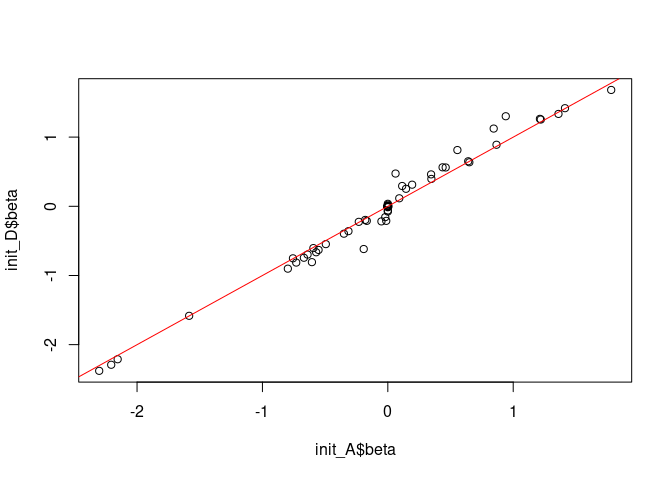<!-- -->

``` r
init_A$sigma20
```

    FALSE          [,1]
    FALSE [1,] 63.38135

``` r
init_A$sigma2
```

    FALSE [1] 78.75028

``` r
init_D$sigma_epsilon^2
```

    FALSE [1] 78.75028

``` r
system.time({Daniel<-
Gibbs_q(x = xx,
        y = y,
        u = u,
        barvx = barvx,
        tt = tt,k = k,phi = phi,r2_q_grid = r2_q_grid,a=a,
        b=b,
        aa=aa,
        bb=bb,
        nrep=100,
        burning=0)|>sort()})
```

    FALSE    user  system elapsed 
    FALSE  43.156   0.108  43.348

``` r
system.time({Augustin<-Gibbs(N=100,a=a,A=aa,b=b,B=bb,k=k,U=0,phi=0,X=xx,Y=y)$q|>sort()})
```

    FALSE [1] 50
    FALSE [1] 100

    FALSE    user  system elapsed 
    FALSE  59.283   0.048  59.337

``` r
plot(Daniel);plot(Augustin)
```

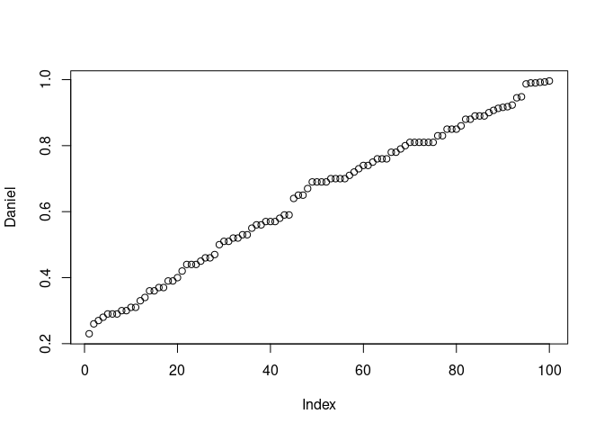<!-- -->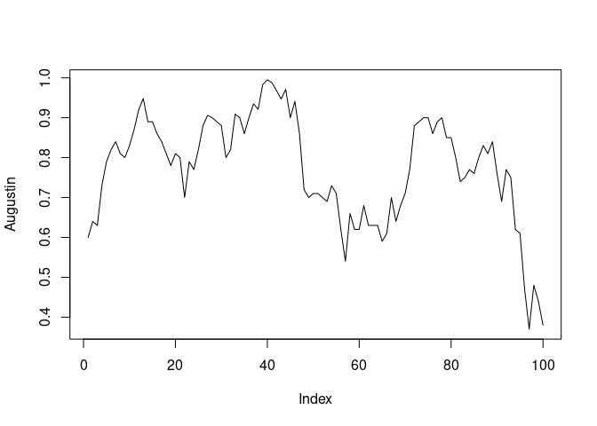<!-- -->

``` r
cbind(Daniel=plyr::raply(100,Gibbs_q(x = xx,
        y = y,
        u = u,
        barvx = barvx,
        tt = tt,k = k,phi = phi,r2_q_grid = r2_q_grid,a=a,
        b=b,
        aa=aa,
        bb=bb,
        nrep=1,
        burning=0))|>sort(),Augustin=plyr::raply(100,Gibbs(N=1,a=a,A=aa,b=b,B=bb,k=k,U=0,phi=0,X=xx,Y=y)$q)|>sort())->mat
mat|>
  plot();abline(0,1,col="red")
```

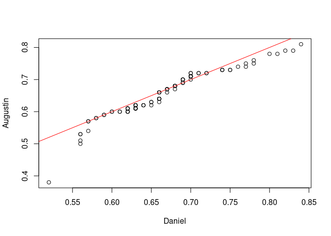<!-- -->

``` r
mat|>reshape2::melt()|>ggplot(aes(x=Var2,y=value,group=Var2,colour=Var2))+geom_violin()+geom_jitter()
```

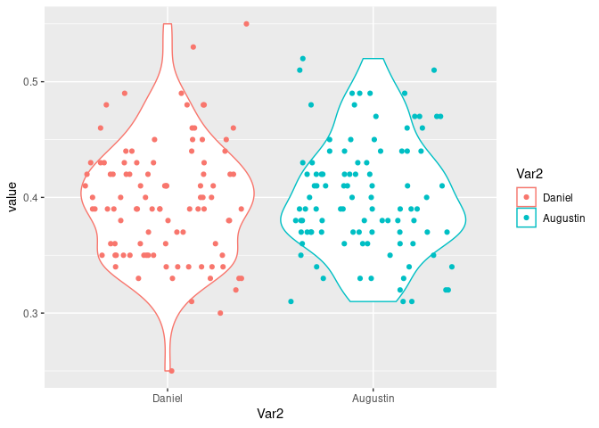<!-- -->

``` r
cbind(Daniel=Daniel,Augustin=Augustin)|>
  plot();abline(0,1,color="red")
```

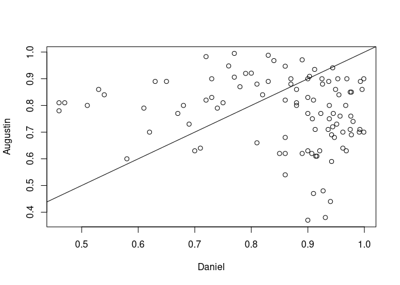<!-- -->
