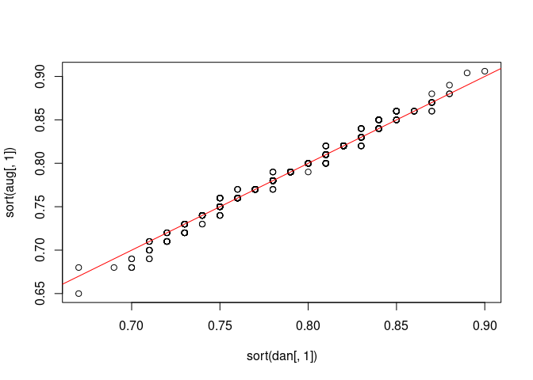
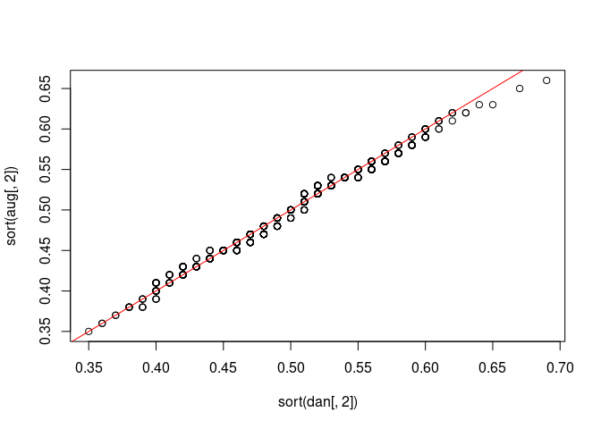
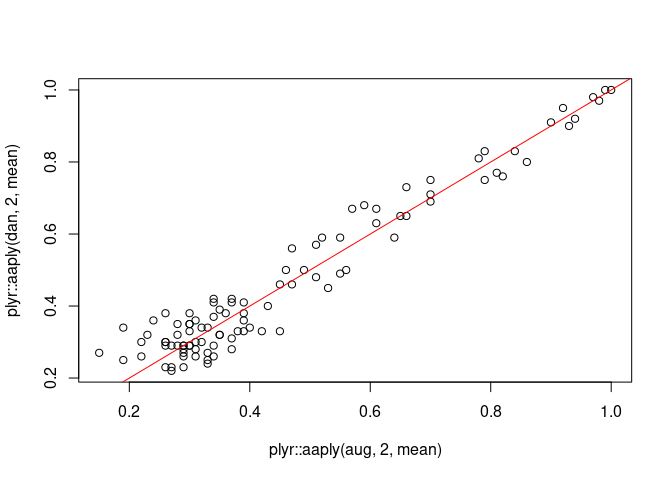
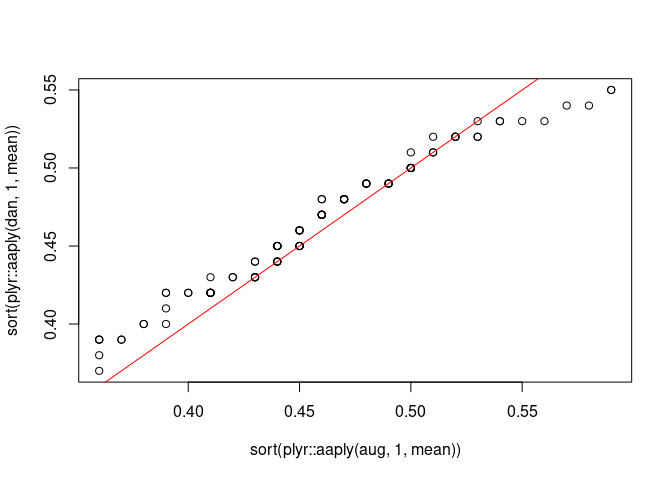
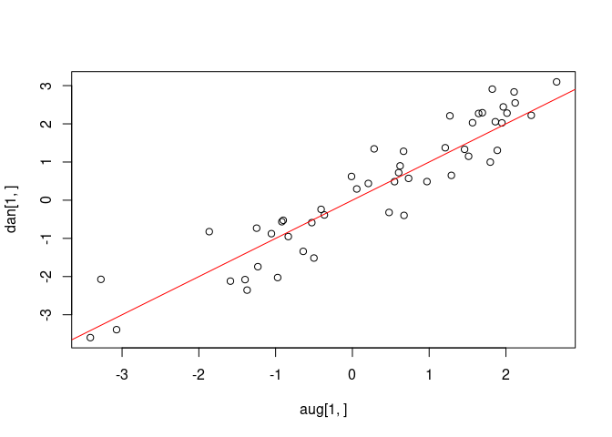

Assignment 2
================
Daniel Bonnery, Max Kramkimel, Augustin Poissonnier
Dec 5, 2023

# Bayesian Statistics, Assignment 2

## Comparaison of Augustin and Daniel samplers

### Test sampler r2 q

``` r
a=default_a
b=default_b
A=aa=default_aa
B=bb=default_bb
k=default_k
s=50
r_y=default_r_y[3]
X=xx=generate_multiple_x(number_of_datasets = 1)[[1]]
Y=y=generate_single_y(s=s,r_y=r_y,xx = xx)
sigma2=12;
sigma_epsilon=sqrt(sigma2)
phi=0
z=rep(1:0,each=50)
beta<-(`[<-`)(z,1:50,rnorm(50))
m=1000
aug=draw_conditional_posterior_R2_q(m,Y,U,X,sigma2,phi,beta,z,a,b,A,B)
U=u=generate_u();
barvx=barvx_f(xx)
tbetabeta=t(beta)%*%beta
s_z=sum(z)
r2_q_grid=r2_q_grid_generate()
dan=sample_r2_q_cond_y_u_x_theta_z(sigma_epsilon,barvx,k,a,b,aa,bb,tbetabeta,s_z,r2_q_grid,m=m)
plot(sort(dan[,1]),sort(aug[,1]));abline(0,1,col='red')
```

<!-- -->

``` r
plot(sort(dan[,2]),sort(aug[,2]));abline(0,1,col='red')
```

<!-- -->

### Test sampler z\_i

``` r
a=default_a
b=default_b
A=aa=default_aa
B=bb=default_bb
k=default_k
s=50
r_y=default_r_y[3]
X=xx=generate_multiple_x(number_of_datasets = 1)[[1]]
Y=y=generate_single_y(s=s,r_y=r_y,xx = xx)
sigma2=12;
sigma_epsilon=sqrt(sigma2)
phi=0
z=rep(1:0,each=50)
beta<-(`[<-`)(z,1:50,rnorm(50))
m=1000
R2=r2=.8
v_X=sum_var(X)
U=u=generate_u();
barvx=barvx_f(xx)
tbetabeta=t(beta)%*%beta
s_z=sum(z)
r2_q_grid=r2_q_grid_generate()
q=mean(z)
gamma2=gamma2_f(r2 = r2,k = k,q = q,barvx = barvx)
gamma2_aug=R2/(k*q*v_X*(1-R2))
tilde_y=y
ttildeytildey=t(tilde_y)%*%tilde_y
tt=default_tt
aug=sample_conditional_posterior_zi(Y,U,X,sigma2,phi,gamma2_aug,q,z,i=1,m=m)
dan=sample_zi_cond_zj_y_u_x_phi_gamma(z,i=1,tilde_y,ttildeytildey,xx,q,tt,k,gamma2,m=m)
mean(aug);mean(dan)
```

    FALSE [1] 0.309

    FALSE [1] 0.299

### Test sampler z

``` r
a=default_a
b=default_b
A=aa=default_aa
B=bb=default_bb
k=default_k
s=50
r_y=default_r_y[3]
x=X=xx=generate_multiple_x(number_of_datasets = 1)[[1]]
Y=y=generate_single_y(s=s,r_y=r_y,xx = xx)
sigma2=12;
sigma_epsilon=sqrt(sigma2)
phi=0
z=rep(1:0,each=50)
beta<-(`[<-`)(z,1:50,rnorm(50))
m=1000
R2=r2=.8
v_X=sum_var(X)
U=u=generate_u();
barvx=barvx_f(xx)
tbetabeta=t(beta)%*%beta
s_z=sum(z)
r2_q_grid=r2_q_grid_generate()
q=mean(z)
gamma2=gamma2_f(r2 = r2,k = k,q = q,barvx = barvx)
gamma2_aug=R2/(k*q*v_X*(1-R2))
tilde_y=y
ttildeytildey=t(tilde_y)%*%tilde_y
tt=default_tt
aug=plyr::raply(100,sample_conditional_posterior_z(Y,U,X,phi,R2,q,z))
dan=plyr::raply(100,sample_z_cond_y_u_x_phi_gamma(z,tilde_y,ttildeytildey,x,q,tt,k,gamma2))
plot(aug|>plyr::aaply(2,mean),dan|>plyr::aaply(2,mean));abline(0,1,col="red")
```

<!-- -->

``` r
plot(sort(aug|>plyr::aaply(1,mean)),sort(dan|>plyr::aaply(1,mean)));abline(0,1,col="red")
```

<!-- -->

### Test sampler sigma2

``` r
a=default_a
b=default_b
A=aa=default_aa
B=bb=default_bb
k=default_k
s=50
r_y=default_r_y[3]
x=X=xx=generate_multiple_x(number_of_datasets = 1)[[1]]
Y=y=generate_single_y(s=s,r_y=r_y,xx = xx)
sigma2=12;
sigma_epsilon=sqrt(sigma2)
phi=0
z=rep(1:0,each=50)
beta<-(`[<-`)(z,1:50,rnorm(50))
m=1000
R2=r2=.8
v_X=sum_var(X)
U=u=generate_u();
barvx=barvx_f(xx)
tbetabeta=t(beta)%*%beta
s_z=sum(z)
r2_q_grid=r2_q_grid_generate()
q=mean(z)
gamma2=gamma2_f(r2 = r2,k = k,q = q,barvx = barvx)
gamma2_aug=R2/(k*q*v_X*(1-R2))
tilde_y=y
Y_tilde=Y
ttildeytildey=t(tilde_y)%*%tilde_y
tt=default_tt
tilde_x=x[,z==1]
X_tilde<-def_X_tilde(X,z)
k_aug<-dim(X)[2]
  I_sz <- diag(1, nrow = sum(z), ncol = sum(z))
v_X <- sum_var(X)
gamma2<-R2/(k*q*v_X*(1-R2))
W_tilde<-t(X_tilde)%*%X_tilde + I_sz/gamma2
tilde_w=(t(tilde_x)%*%tilde_x+diag(s_z)/gamma2)
inv_tilde_w=if(s_z==0){0}else{solve(tilde_w)}
hat_tilde_beta=inv_tilde_w%*%t(tilde_x)%*%(tilde_y)
range(tilde_w-W_tilde)
```

    FALSE [1] 0 0

``` r
range(tilde_x-X_tilde)
```

    FALSE [1] 0 0

``` r
range(tilde_y-Y_tilde)
```

    FALSE [1] 0 0

``` r
shape<-length(Y)/2 
gamma2<-R2/(k*q*v_X*(1-R2))
W_tilde<-t(X_tilde)%*%X_tilde + I_sz/gamma2_aug
beta_tilde_hat <- solve(W_tilde)%*%t(X_tilde)%*%Y_tilde
range(hat_tilde_beta-beta_tilde_hat)
```

    FALSE [1] 0 0

``` r
scale<-t(beta_tilde_hat)%*%W_tilde%*%beta_tilde_hat
scale<- t(Y_tilde)%*%Y_tilde - scale
scale_aug<-scale/2
rate_dan=(ttildeytildey-t(hat_tilde_beta)%*%tilde_w%*%hat_tilde_beta)/2
aug=sample_conditional_posterior_sigma2(Y,U,X,phi,R2, q, z,m=m)|>sort()
dan=sample_sigmaepsilon_cond_y_u_x_phi_r2_q_z(z,tt,ttildeytildey,tilde_w,hat_tilde_beta,m=m)|>(`^`)(2)|>sort()
plot(aug,dan);abline(0,1,col='red')
```

<!-- -->

### V. test sampler beta

``` r
a=default_a
b=default_b
A=aa=default_aa
B=bb=default_bb
k=default_k
s=50
r_y=default_r_y[3]
x=X=xx=generate_multiple_x(number_of_datasets = 1)[[1]]
Y=y=generate_single_y(s=s,r_y=r_y,xx = xx)
sigma2=12;
sigma_epsilon=sqrt(sigma2)
phi=0
z=rep(1:0,each=50)
beta<-(`[<-`)(z,1:50,rnorm(50))
m=1000
R2=r2=.8
v_X=sum_var(X)
U=u=generate_u();
barvx=barvx_f(xx)
tbetabeta=t(beta)%*%beta
s_z=sum(z)
r2_q_grid=r2_q_grid_generate()
q=mean(z)
gamma2=gamma2_f(r2 = r2,k = k,q = q,barvx = barvx)
gamma2_aug=R2/(k*q*v_X*(1-R2))
tilde_y=y
Y_tilde=Y
ttildeytildey=t(tilde_y)%*%tilde_y
tt=default_tt
tilde_x=x[,z==1]
X_tilde<-def_X_tilde(X,z)
k_aug<-dim(X)[2]
  I_sz <- diag(1, nrow = sum(z), ncol = sum(z))
v_X <- sum_var(X)
gamma2<-R2/(k*q*v_X*(1-R2))
W_tilde<-t(X_tilde)%*%X_tilde + I_sz/gamma2
tilde_w=(t(tilde_x)%*%tilde_x+diag(s_z)/gamma2)
inv_tilde_w=if(s_z==0){0}else{solve(tilde_w)}
hat_tilde_beta=inv_tilde_w%*%t(tilde_x)%*%(tilde_y)
range(tilde_w-W_tilde)
```

    FALSE [1] 0 0

``` r
range(tilde_x-X_tilde)
```

    FALSE [1] 0 0

``` r
range(tilde_y-Y_tilde)
```

    FALSE [1] 0 0

``` r
shape<-length(Y)/2 
gamma2<-R2/(k*q*v_X*(1-R2))
W_tilde<-t(X_tilde)%*%X_tilde + I_sz/gamma2_aug
beta_tilde_hat <- solve(W_tilde)%*%t(X_tilde)%*%Y_tilde
range(hat_tilde_beta-beta_tilde_hat)
```

    FALSE [1] 0 0

``` r
scale<-t(beta_tilde_hat)%*%W_tilde%*%beta_tilde_hat
scale<- t(Y_tilde)%*%Y_tilde - scale
scale_aug<-scale/2
rate_dan=(ttildeytildey-t(hat_tilde_beta)%*%tilde_w%*%hat_tilde_beta)/2
mean_vector<-solve(W_tilde)%*%t(X_tilde)%*%Y_tilde
covariance_matrix<-sigma2*solve(W_tilde)
mu = inv_tilde_w%*%t(tilde_x)%*%(tilde_y)
Sigma = (sigma_epsilon^2)*inv_tilde_w
range(mu-mean_vector)
```

    FALSE [1] 0 0

``` r
range(Sigma-covariance_matrix)
```

    FALSE [1] -5.551115e-17  2.775558e-17

``` r
aug=sample_conditional_posterior_beta_tilde(Y,U,X,phi,R2,q,sigma2,z,m=m)
dan=sample_tildebeta_cond_y_u_x_phi_r2_q_z_sigma2(sigma_epsilon,tilde_y,tilde_x,tilde_w,m=m)
plot(aug[1,],dan[1,]);abline(0,1,col='red')
```

<!-- -->

``` r
plot(aug[,1]|>sort(),dan[,1]|>sort());abline(0,1,col='red')
```

<!-- -->
