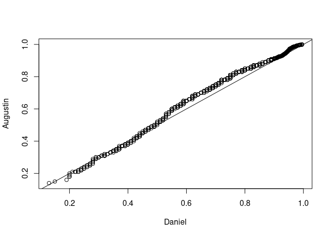
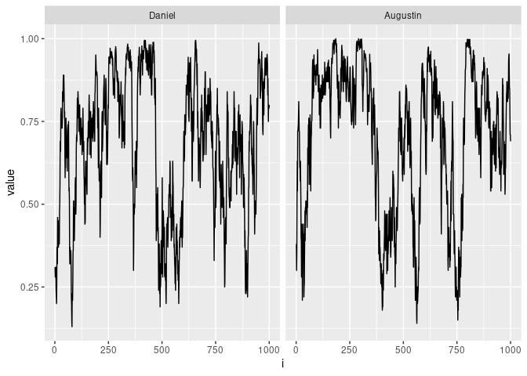

Assignment 2
================
Daniel Bonnery, Max Kramkimel, Augustin Poissonnier
Dec 5, 2023

# Bayesian Statistics, Assignment 2

## Comparaison of Augustin and Daniel gibbs chain

``` r
a=default_a
b=default_b
A=aa=default_aa
B=bb=default_bb
k=default_k
s=100
r_y=default_r_y[3]
x=X=xx=generate_multiple_x(number_of_datasets = 1)[[1]]
Y=y=generate_single_y(s=s,r_y=r_y,xx = xx)
sigma2=12;
sigma_epsilon=sqrt(sigma2)
phi=0
z=rep(1:0,each=50)
beta<-(`[<-`)(z,1:50,rnorm(50))
m=1000
R2=r2=.8
v_X=sum_var(X)
U=u=generate_u();
barvx=barvx_f(xx)
tbetabeta=t(beta)%*%beta
s_z=sum(z)
r2_q_grid=r2_q_grid_generate()
q=mean(z)
gamma2=gamma2_f(r2 = r2,k = k,q = q,barvx = barvx)
gamma2_aug=R2/(k*q*v_X*(1-R2))
tilde_y=y
Y_tilde=Y
ttildeytildey=t(tilde_y)%*%tilde_y
tt=default_tt
tilde_x=x[,z==1]
X_tilde<-def_X_tilde(X,z)
k_aug<-dim(X)[2]
  I_sz <- diag(1, nrow = sum(z), ncol = sum(z))
v_X <- sum_var(X)
gamma2<-R2/(k*q*v_X*(1-R2))
W_tilde<-t(X_tilde)%*%X_tilde + I_sz/gamma2
tilde_w=(t(tilde_x)%*%tilde_x+diag(s_z)/gamma2)
inv_tilde_w=if(s_z==0){0}else{solve(tilde_w)}
hat_tilde_beta=inv_tilde_w%*%t(tilde_x)%*%(tilde_y)
shape<-length(Y)/2 
gamma2<-R2/(k*q*v_X*(1-R2))
W_tilde<-t(X_tilde)%*%X_tilde + I_sz/gamma2_aug
beta_tilde_hat <- solve(W_tilde)%*%t(X_tilde)%*%Y_tilde
range(hat_tilde_beta-beta_tilde_hat)
```

    FALSE [1] 0 0

``` r
scale<-t(beta_tilde_hat)%*%W_tilde%*%beta_tilde_hat
scale<- t(Y_tilde)%*%Y_tilde - scale
scale_aug<-scale/2
rate_dan=(ttildeytildey-t(hat_tilde_beta)%*%tilde_w%*%hat_tilde_beta)/2
mean_vector<-solve(W_tilde)%*%t(X_tilde)%*%Y_tilde
covariance_matrix<-sigma2*solve(W_tilde)
mu = inv_tilde_w%*%t(tilde_x)%*%(tilde_y)
Sigma = (sigma_epsilon^2)*inv_tilde_w
range(mu-mean_vector)
```

    FALSE [1] 0 0

``` r
range(Sigma-covariance_matrix)
```

    FALSE [1] -5.551115e-17  2.775558e-17

### Test gibbs one step.

``` r
set.seed(1)
if(!file.exists("compare.rda")){
system.time({Daniel<-
Gibbs_q(x = xx,
        y = y,
        u = u,
        barvx = barvx,
        tt = tt,k = k,phi = phi,r2_q_grid = r2_q_grid,a=a,
        b=b,
        aa=aa,
        bb=bb,
        nrep=1000,
        burning=0)})
system.time({Augustin<-Gibbs(N=1000,a=a,A=aa,b=b,B=bb,k=k,U=0,phi=0,X=xx,Y=y)$q})
save(s,r_y,Daniel,Augustin,file="compare.rda")
}

load("compare.rda")
library(ggplot2)
s
```

    FALSE [1] 100

``` r
r_y
```

    FALSE [1] 0.5

``` r
cbind(Daniel,Augustin)|>reshape2::melt()|>
  dplyr::group_by(Var2)|>
  dplyr::mutate(i=dplyr::row_number(),Eq=mean(value),true=s/default_k)|>
  dplyr::ungroup()->
  results
results|>
  ggplot(aes(x=value,xintercept=Eq))+
  geom_histogram()+
  facet_grid(~Var2)+
  geom_vline(aes(xintercept=Eq))+
  geom_vline(aes(xintercept=true),color="red")
```

<!-- -->

``` r
cbind(Daniel=Daniel|>sort(),Augustin=Augustin|>sort())|>
  plot();abline(0,1,color="red")
```

<!-- -->

``` r
results|>ggplot(aes(x=i,y=value))+
  geom_line()+
  facet_grid(~Var2)
```

<!-- -->
